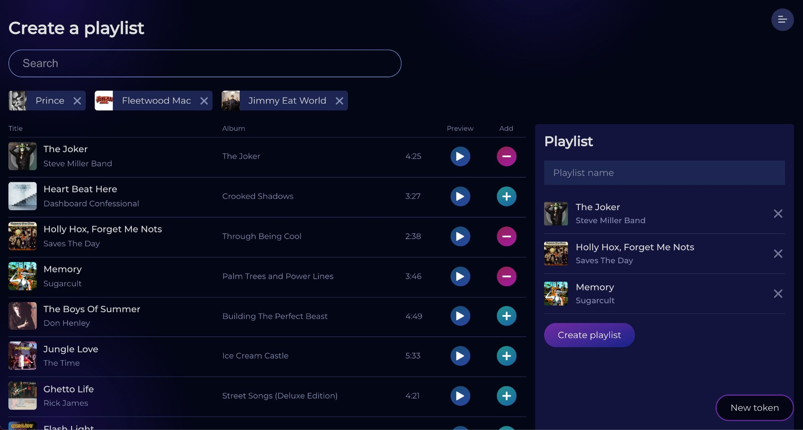
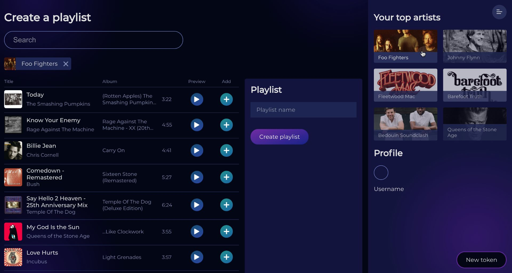

# Spotify Playlist Generator (WIP)

Create Spotify playlists by searching for an artist and selecting suggested tracks generated using Spotify web APIs. Spotify's play button is embedded to allow users to listen to the songs before adding them to the playlist.

## Screenshots

## Tech

JavaScript, web components (custom elements, shadow DOM, templates).

## Run

From `/app` run `node app.js`

### Generate access keys

Create an account/login to Spotify developers dashboard: https://developer.spotify.com/dashboard/login

Spotify web API docs: https://developer.spotify.com/documentation/web-api/
